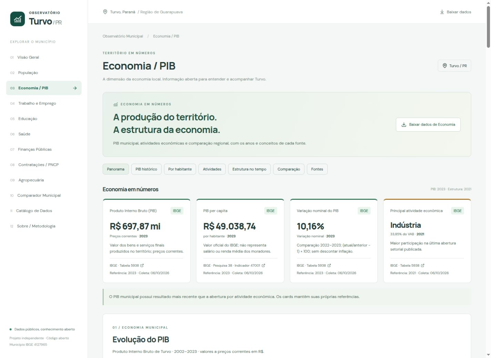

# Economia / PIB de Turvo

Módulo estático com fonte autoritativa **IBGE**, município **4127965**, e comparações com Guarapuava (4109401), Pitanga (4119608) e Laranjal (4113254). Não usa demonstrações, IA generativa, scraping, servidor MCP, banco ou Worker. O navegador lê apenas arquivos locais publicados junto do site.

## APIs e descoberta dos conceitos

Metadados, períodos e consultas do agregado:

- [Metadados da tabela 5938](https://servicodados.ibge.gov.br/api/v3/agregados/5938/metadados).
- [Períodos publicados](https://servicodados.ibge.gov.br/api/v3/agregados/5938/periodos).
- Dados: `/api/v3/agregados/5938/periodos/{anos}/variaveis/{ids}?localidades=N6[{codigo}]`.
- [Hierarquia da pesquisa 38](https://servicodados.ibge.gov.br/api/v1/pesquisas/38/indicadores).
- [Metadados do indicador 47001](https://servicodados.ibge.gov.br/api/v1/pesquisas/indicadores/47001).
- [PIB per capita oficial de Turvo](https://servicodados.ibge.gov.br/api/v1/pesquisas/indicadores/47001/resultados/4127965).
- [Publicação, metodologia e conceitos do IBGE](https://www.ibge.gov.br/estatisticas/economicas/contas-nacionais/9088-produto-interno-bruto-dos-municipios.html).
- [Nota técnica sobre a reformulação das Contas Nacionais](https://biblioteca.ibge.gov.br/visualizacao/livros/liv102094.pdf).

Na inspeção de 06/10/2026, `apisidra.ibge.gov.br` respondeu normalmente à consulta do PIB 2023. O novo módulo usa exclusivamente Agregados v3 e Pesquisas v1, sem depender dessa disponibilidade e sem mecanismo para contornar desafios. A integração funcional do PIB foi preservada, com o mesmo ID `gdp`, série e valores, agora com metadados completos.

## Variáveis confirmadas

A tabela **5938**, PIB dos Municípios, referência **2010**, não possui classificações: atividades são variáveis distintas. Todas as variáveis abaixo suportam nível municipal **N6**.

| ID | Conceito | Unidade original | Observações numéricas na coleta |
| --- | --- | --- | --- |
| 37 | Produto Interno Bruto a preços correntes | Mil Reais | 2002–2023 |
| 498 | Valor adicionado bruto a preços correntes total | Mil Reais | 2002–2021 |
| 513 | VAB da agropecuária | Mil Reais | 2002–2021 |
| 516 | Participação da agropecuária no VAB total | % | 2002–2021 |
| 517 | VAB da indústria | Mil Reais | 2002–2021 |
| 520 | Participação da indústria no VAB total | % | 2002–2021 |
| 6575 | VAB dos serviços, exclusive administração, defesa, educação e saúde públicas e seguridade social | Mil Reais | 2002–2021 |
| 6574 | Participação desses serviços no VAB total | % | 2002–2021 |
| 525 | VAB da administração, defesa, educação e saúde públicas e seguridade social | Mil Reais | 2002–2021 |
| 528 | Participação dessas atividades públicas no VAB total | % | 2002–2021 |
| 543 | Impostos, líquidos de subsídios, sobre produtos a preços correntes | Mil Reais | 2002–2021 |

**543 não é PIB per capita, e sua unidade não é Reais.** A associação parcial anterior foi corrigida. As variáveis de participação na microrregião, mesorregião, estado ou Brasil não são usadas como participação na economia municipal.

PIB per capita vem da pesquisa **38**, pai **47000 (PIB per capita)**, folha **47001 (Série revisada)**, unidade oficial **R$**, multiplicador **1**. O ETL valida ambos os níveis da hierarquia e o vínculo com a pesquisa. A API retorna o código de seis dígitos (412796), verificado explicitamente contra o código IBGE sem o dígito final. A série retornada é **2010–2023** para os quatro municípios; a série encerrada 47002 não é concatenada. Não fabricamos 2002–2009 ou calculamos um indicador substituto dividindo por outra série de população.

## Retrato coletado

Os números abaixo documentam o resultado do ETL; não são constantes usadas para alimentar o site.

| Indicador de Turvo | Referência | Valor |
| --- | --- | --- |
| PIB | 2023 | R$ 697.870.000,00 |
| PIB per capita | 2023 | R$ 49.038,74 |
| Variação nominal do PIB | 2022 → 2023 | 10,156836994336448% (interface: 10,16%) |
| VAB total | 2021 | R$ 549.820.000,00 |
| VAB Agropecuária | 2021 | R$ 162.255.000,00; 29,51% do VAB |
| VAB Indústria | 2021 | R$ 186.098.000,00; 33,85% do VAB |
| VAB Serviços, exceto atividades públicas | 2021 | R$ 131.716.000,00; 23,96% do VAB |
| VAB Administração pública e demais atividades públicas | 2021 | R$ 69.752.000,00; 12,69% do VAB |
| Impostos líquidos de subsídios sobre produtos | 2021 | R$ 51.801.000,00 |

A principal atividade na última abertura é a Indústria. Isso não descreve a composição de 2023, os empregos gerados ou causas da evolução.

## Referências independentes e conceitos

PIB mede o valor dos bens e serviços finais produzidos no território. PIB per capita é a relação entre PIB e população utilizada na metodologia oficial; não representa salário, renda individual, distribuição de renda ou qualidade de vida. Parte da renda produzida pode ser apropriada por residentes de outros municípios.

Valores a preços correntes refletem os preços de cada ano; não descontam inflação. **Variação nominal** = `(PIB atual / PIB anterior − 1) × 100`. O ETL usa observações consecutivas ordenadas, guarda `from` e `annual`, não interpola, não anualiza intervalos, e retorna null na primeira observação ou quando a base é zero. Não produz “PIB real” nem aplica IPCA como deflator municipal oficial.

VAB representa o valor gerado pelas atividades antes dos impostos líquidos sobre produtos. **PIB ≈ VAB total + impostos líquidos de subsídios sobre produtos**. As quatro participações utilizadas são percentuais oficiais sobre o **VAB total**; serviços excluem o componente público que aparece separadamente. Impostos não são setor: sua participação no PIB do mesmo ano é um cálculo derivado explícito, sem somá-la aos percentuais do VAB.

O componente de administração pública do VAB não equivale ao orçamento, receita ou despesa da Prefeitura. RAIS/CAGED, produtos e quantidades agrícolas e finanças municipais permanecem em seus próprios módulos.

**2022 e 2023 não possuem abertura setorial, VAB total e impostos nesta publicação.** O agregado retorna `...` nas variáveis detalhadas. Guardamos essa ausência em `sectorComposition.unavailable`, com os símbolos brutos e vínculo à nota técnica. PIB termina em 2023; estrutura econômica e impostos terminam em 2021. Novos anos sem abertura além da exceção documentada exigirão revisão da metodologia; o ETL preservará o snapshot até essa revisão.

Percentuais oficiais não são renormalizados; as quatro parcelas podem somar 100,01% por arredondamento. Tolerâncias de validação: soma percentual até 0,03 ponto percentual; diferença entre percentual publicado e razão dos valores até 0,02 ponto; soma dos valores setoriais até R$ 4.000; identidade PIB/VAB/impostos até R$ 2.000. São limites relacionados à publicação em mil reais e percentuais com duas casas, não ajustes dos números oficiais. Atividade principal = maior participação; empates seguem a ordem declarada dos setores (agropecuária, indústria, serviços, atividades públicas).

Comparações exigem mesmo indicador, unidade, metodologia e ano. Variações também exigem a mesma base temporal e intervalo. Os quatro municípios são coletados pelas mesmas fontes. PIB total não fornece ranking de bem-estar. Tentativa de consultar Paraná pelo indicador 47001 retornou HTTP 500; não foi publicado benchmark estadual ou indicador nacional como municipal.

## Contrato, auditoria e atualização

`public/data/economy.json`, schemaVersion 1:

- `municipality`: código, nome, UF.
- `summary`: quatro indicadores com referência, órgão, conceito, coleta, URL e sourceId.
- `gdp`: reais, série de pontos com variável 37, sourceId, período, valor, referência anterior, variação nominal e marcador de intervalo anual.
- `gdpPerCapita`: valor oficial, série revisada, variável 47001, sourceId e ausências documentadas quando retornadas.
- `sectorComposition`: VAB total e quatro setores por período, valores, participações oficiais, respectivos IDs, unidades, denominador, atividade principal e anos indisponíveis.
- `taxes`: série de valores oficiais e participação derivada no PIB do mesmo ano, separada dos setores.
- `comparisons`: mesmos conjuntos para os três municípios próximos, cada um com código e fontes próprios.
- `sources`: oito consultas com pesquisa, tabela ou indicador, variáveis, classificações (vazias), períodos solicitados, unidade original, município, URLs de consulta e metadados, coleta, transformações e rawPath.
- `methodology`: preços correntes, referência 2010 e links oficiais de conceitos e exceção setorial.
- `collection`: tentativa, último sucesso, falhas e política de preservação integral.

Respostas brutas, metadados, hierarquia per capita e lista oficial de períodos ficam em `public/data/economy/raw/`, com hash do conteúdo no nome. Os números publicados são derivados dessas respostas, nunca de texto produzido por IA. `collectedAt` registra a coleta; não representa publicação ou ano do indicador. Cada coleta completa bem-sucedida registra uma nova data; revisões são rastreáveis pelo Git.

Conversão monetária do agregado: `Mil Reais × 1.000 → R$`. Percentuais oficiais e valores per capita preservam sua precisão publicada; formatação arredonda apenas na interface. Símbolo SIDRA `-` = zero absoluto, tratado explicitamente pelo conector com símbolo original preservado. `X`, `..`, `...` e null são ausências/supressão, nunca zero. O PIB obrigatório ausente, abertura parcial, município incorreto, unidade divergente, célula duplicada ou soma incoerente impedem publicação.

`gdp.csv`, `gdp-per-capita.csv` e `economy-sectors.csv` são gerados pelo ETL para os quatro municípios, com período, unidade, código, variável, sourceId, URL e coleta. Impostos e séries completas estão no JSON. `indicators.json` e `comparison.json` recebem somente os resumos de Economia; indicadores dos outros módulos não são substituídos. A rotina legada evita recolher o PIB quando o snapshot dedicado existe.

O ETL valida toda a coleta e comparações antes de substituir arquivos. Cada arquivo tem troca atômica; não existe transação entre vários arquivos, e a versão pública deve ser publicada após o build e as validações. Falhas de consulta/validação mantêm os números, fontes e exports anteriores e registram a tentativa em economy.json. Na primeira coleta, erro não publica dados artificiais. Atualização do IBGE é anual; workflow proposto verifica semanalmente, com cache por tabela para metadados/períodos durante uma execução e timeout/retries da biblioteca padrão.

```sh
python3 scripts/etl.py --module economy
python3 scripts/etl.py --module economy --offline
npm test
npm run build
```

A página em `src/modules/economy/` usa carregamento sob demanda, estados de carregamento/erro/retry, Recharts existente, rótulos de unidade/ano e tabelas alternativas em todos os gráficos. Narrativas são funções determinísticas testadas. Funciona com snapshots offline; sem novos serviços ou dependências.

## MCP Brasil, IPEADATA e BACEN

Inspecionados os clientes/ferramentas de IBGE (agregados, pesquisas e municípios), IPEADATA e BACEN do [Mcp-Brasil/mcp-brasil](https://github.com/Mcp-Brasil/mcp-brasil/tree/2efb258370b125bbf190884283ae10f209b9d335/src/mcp_brasil/data), versão consultada em 06/10/2026. A descoberta de agregados e filtros municipais foi útil; seu atalho de PIB per capita usa tabela 6784, **nacional**, e não atende ao conceito municipal. Foi utilizado o indicador municipal oficial 47001.

O cliente IPEADATA mostra descoberta OData por prefixo e valores com nível/território. Consulta oficial ao catálogo `http://ipeadata.gov.br/api/odata4/Metadados` com filtro `startswith(SERNOME, 'PIB')` identificou séries regionais PIB_IBGE_5938_37, PIBAG, PIBI, PIBSE, PIBG e IMPPIB, descritas em preços de 2010. Não foram integradas: repetem conceitos já cobertos, têm tratamento monetário diferente e exigiriam curadoria própria; não acrescentam um dado necessário nesta entrega. BACEN/SGS e Focus oferecem IPCA, Selic e contexto nacional, que não foram publicados como indicadores de Turvo nem utilizados para gerar “PIB real”.

MCP Brasil é referência de descoberta durante desenvolvimento, não produtor dos indicadores nem dependência runtime. Nenhum código foi copiado. **IBGE permanece a fonte autoritativa dos dados de Economia publicados.**

## Validação e próximos passos

A suíte cobre metadados, conversão monetária, hierarquia e unidade per capita, código municipal, períodos, símbolos, duplicatas, setores, soma e identidade contábil, denominadores, referências independentes, comparações, narrativas, formatação, carga local, offline e preservação em falhas. Validação concluída em 06/10/2026: **85 testes aprovados** (64 Python + 21 JavaScript), incluindo 41 novos de Economia. Validação offline e build TypeScript/Vite aprovados. A inspeção visual conferiu desktop (1440 px), celular (390 px, sem extravasamento da página), alternância do gráfico, tabelas e integração ao Comparador; nenhum erro de interface registrado. A página de Economia gera um chunk de aproximadamente 28 kB, carregado sob demanda.



TODOs: incorporar novas divulgações após revisão dos metadados; investigar benchmark estadual por fonte compatível; registro público de revisões; schema JSON formal; auditoria WCAG mais abrangente. Eventual série analítica deflacionada precisa de índice adequado, ano-base, fórmula e limites explícitos, sem chamar de PIB real oficial municipal.
