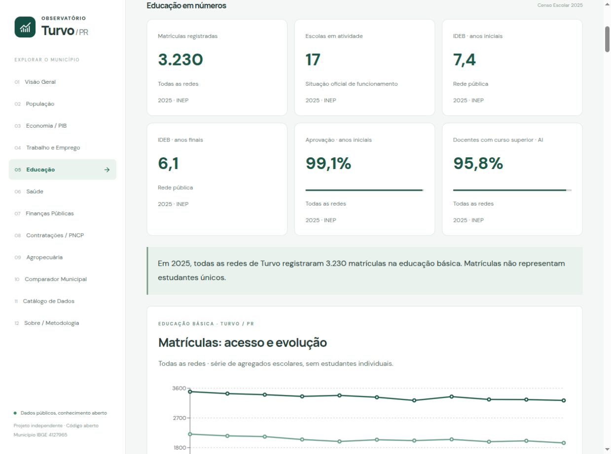

# Educação básica de Turvo/PR

Módulo implementado com publicações oficiais do **INEP**, consultadas em **06/10/2026**, território **4127965**, UF **PR**. Navegação `#education`; comparação também disponível no Comparador Municipal. O navegador lê apenas snapshots estáticos. Não usa API fictícia do INEP, MCP Brasil em runtime, Worker, banco, autenticação ou registros individuais.

## Resultado e cobertura

| Medida | Turvo, todas as redes, 2025 |
| --- | ---: |
| Matrículas na educação básica | 3.230 |
| Escolas em atividade no universo da educação básica | 17 |
| Escolas municipais / estaduais / privadas / federais | 9 / 7 / 1 / 0 |
| Matrículas municipais / estaduais / privadas / federais | 1.793 / 1.388 / 49 / 0 |
| Educação infantil: creche / pré-escola | 292 / 421 (total 713) |
| Ensino fundamental: iniciais / finais | 1.188 / 756 (total 1.944) |
| Ensino médio / EJA / profissional | 543 / 30 / 0 |
| Educação especial (recorte sobreposto) | 187 |
| Tempo integral (campo oficial) | 245 |
| Docentes únicos no universo municipal da Sinopse 2.2 | 250 |
| Docências somadas nos agregados das escolas | 290 |
| Turmas | 216 |
| Escolas urbanas / rurais | 8 / 9 |
| Matrículas urbanas / rurais | 2.195 / 1.035 |
| IDEB público: iniciais / finais / médio regular | 7,4 / 6,1 / 5,3 |
| Criança Alfabetizada, rede municipal | 92% (meta 80%; participação 96%) |
| Aprovação: iniciais / finais / médio | 99,1% / 99,7% / 100% |
| Distorção idade-série: iniciais / finais / médio | 13,7% / 11% / 10,3% |
| Docentes com curso superior: iniciais / finais / médio | 95,8% / 91,8% / 95,9% |

**Matrículas não são estudantes únicos.** A escola se localiza em Turvo; não deduzimos município de residência nem taxa de escolarização usando população de outra pesquisa. As 17 escolas são do município, sob diferentes dependências; somente 9 pertencem à rede municipal. Professores podem trabalhar em várias escolas/redes: o total único 250 vem diretamente da Sinopse; 290 é a soma por escola, não pessoas. As contagens das redes também não devem ser somadas para reconstruir docentes únicos.

Histórico real: **Censo 2015–2025**, **IDEB 2005–2025** nos ciclos publicados (ensino médio municipal desde 2017), **alfabetização 2023–2025**. SAEB e os oito indicadores anuais integrados usam edição 2025. Não interpolamos anos, não somamos IDEB entre etapas, não produzimos médias territoriais próprias.

## Arquitetura e arquivos

- `scripts/sources/inep.py`: descoberta de páginas/abas oficiais, download validado, cache SHA-256, leitura de CSV/ZIP/XLSX. Não deriva nomes de arquivo como substituto à descoberta no portal.
- `scripts/modules/education.py`: filtro territorial, normalização por rede/etapa/localização, Censo, Sinopse, avaliações, indicadores, validação, exportação e atualização apenas dos indicadores de Educação no catálogo.
- `scripts/requirements-education.txt`: openpyxl 3.1.5 e et-xmlfile 2.0.0; leitura XLSX em modo somente leitura.
- `src/modules/education/`: página, componentes, gráficos, contrato, carregamento/validação e estilos próprios. Carregamento sob demanda com estados de erro, nova tentativa e cancelamento.
- `public/data/education.json`: schemaVersion 1, agregados de quatro municípios, indicadores, fontes, controles e limitações.
- `public/data/exports/education-{enrolments,ideb,flow,schools,infrastructure,indicators}.csv`: downloads UTF-8 gerados, com fonte/URL/coleta/referência.
- `tests/test_education.py`, `tests/education-data.test.mjs`, `tests/fixtures/education/`: regressões com projeções reais; nenhum ZIP nacional versionado.
- `docs/github-actions/education.yml`: atualização mensal leve e manual; nenhum agendamento semanal pesado.

`education.json` contém `municipality`, `summary`, `census.series`, `schools`, `infrastructure`, `indicators`, `sources`, `officialControls`, `validation`, `collection`, `limitations`. Observações registram `code/state/network/location/stage/modality/metric/value/unit/reference/sourceId/field/status`. `census.units` explicita as unidades de cada contagem; infraestrutura usa `%`. Censo registra cada contagem, localização, turmas, docências e fonte; docentes oficiais têm `teachersSourceId` próprio. Cada fonte contém órgão, página oficial, URL efetivamente descoberta, referência, coleta, tamanho, SHA-256, formato, campos e transformações. `reference` é o período do dado; `collectedAt` não é a data de publicação. Ausentes permanecem `null`/`notDisclosed`.

## Fontes, layouts e decisões

Censo: microdados públicos agregados por escola. O ZIP 2025 tem quatro tabelas escolares (`Tabela_Escola_2025_V2.csv`, `Tabela_Matricula_2025_V2.csv`, `Tabela_Docente_2025_V2.csv`, `Tabela_Turma_2025_V2.csv`), juntadas por `CO_ENTIDADE`, com campos comuns obrigatoriamente idênticos. Não usamos tabelas de pessoas. Edições 2015–2024 usam o CSV legado `microdados_ed_basica_AAAA.csv`. CSV é cp1252, separado por `;`; leitura estrita em streaming filtra somente quatro municípios. O dicionário XLSX **ANEXO I — Dicionário de dados da educação básica**, dentro do ZIP 2025, foi inspecionado para conferir nomes, enumerações e reorganização. Dicionário e arquivos nacionais ficam fora do Git/public.

Territórios: Turvo `4127965`, Guarapuava `4109401`, Pitanga `4119608`, Laranjal `4113254`; sempre UF PR. Paraná só é utilizado na comparação IDEB, código UF `41`. Turvo/SC (`4218806`) é excluído mesmo tendo nome idêntico. Escola usa código INEP `CO_ENTIDADE` de oito dígitos; nunca o confundimos com código IBGE.

Dependência `TP_DEPENDENCIA`: 1 federal, 2 estadual, 3 municipal, 4 privada. Localização `TP_LOCALIZACAO`: 1 urbana, 2 rural. Situação `TP_SITUACAO_FUNCIONAMENTO`: 1 atividade, 2 paralisada, 3 extinta no ano, 4 extinta em anos anteriores, conforme dicionário atual. O resumo considera atividade **e matrículas de educação básica informadas**, no universo da Sinopse. A escola de atendimento especializado `41163478`, em Guarapuava, está ativa, mas fora desse universo; permanece no catálogo institucional, sem receber zero fictício. Escolarização declarada (`IN_REGULAR/IN_EJA/IN_PROF`) com total ausente bloqueia publicação. Turvo possui 17 estabelecimentos na edição 2025; nenhum é descartado por essa regra.

Somamos `QT_MAT_BAS`; subetapas `INF=CRE+PRE` e `FUND=AI+AF` são conferidas quando disponíveis. **Não somamos todos os QT_MAT**: educação especial, profissional e tempo integral podem sobrepor outras etapas. Matrículas de modalidades/etapas ausentes em uma escola deixam o agregado correspondente sem valor. Zero de rede sem escola só é publicado após verificar a cobertura territorial completa; não equivale a resposta vazia da fonte. Mudanças de oferta e de layout ao longo de 2015–2025 exigem leitura cuidadosa.

Sinopse: tabela 1.2 (matrículas), 2.2 (docentes), 3.2 (estabelecimentos), 4.2 (turmas). Cabeçalhos territoriais e grupos de rede são localizados semanticamente em múltiplas linhas. **60 controles independentes, todos iguais, tolerância zero:** 3 medidas × 4 municípios × 5 redes. Os 20 controles docentes são lidos diretamente, sem conferir uma soma incorreta. A conferência independente cobre 2025; não alegamos Sinopse independente em todos os anos históricos.

IDEB: XLSX oficiais em quatro ZIPs, cabeçalho técnico de município/rede e campos `VL_OBSERVADO_AAAA`. Etapa vem do arquivo/aba, jamais da média entre colunas. UF usa cabeçalho humano “Unidade da Federação”/“Rede”. A edição UF/AI 2025 repete uma coluna **não usada**, `VL_INDICADOR_REND_2023`; ignoramos somente essa duplicação conhecida, mantendo rejeição de duplicação territorial/IDEB. Valores entre 0 e 10. Metas do primeiro ciclo terminaram em 2021 e **não** são extrapoladas como metas atuais. Ensino médio comparado é regular; não misturamos modalidade integrada.

SAEB: arquivo censitário municipal 2025, aba `Municípios`, colunas `MEDIA_5_LP/MT`, `MEDIA_9_LP/MT`, `MEDIA_12_LP/MT` para iniciais, finais e médio regular. Escalas de proficiência, não percentuais de acertos. “Total – Estadual e Municipal”, “Total – Federal, Estadual e Municipal” e “Total – Federal, Estadual, Municipal e Privada” são universos diferentes, preservados respectivamente como Estadual e Municipal, Pública e Total. **Participação SAEB municipal não foi integrada**: esta planilha de médias não fornece um campo de participação comparável utilizado pelo conector. Não inventamos participação nem reconstruímos resultados suprimidos. Critérios de divulgação são os do INEP, não um ranking de escolas.

Alfabetização: arquivo municipal 2025 revisado (`...2025_3.xlsx`), rede municipal, 2º ano; `PC_ALUNO_ALFABETIZADO_AAAA`, `META_FINAL_2025`, `PC_AVALIADOS_LP`. A referência municipal não é substituída pelo resultado estadual de universo distinto. Resultado 2023/2024/2025: 83%/85%/92%. Não é IDEB nem alfabetização de toda a população residente.

Indicadores anuais: cabeçalho técnico `NU_ANO_CENSO`, `SG_UF`, `CO_MUNICIPIO`, `NO_CATEGORIA`, `NO_DEPENDENCIA`; códigos de etapa `ED_INF/CRE/PRE/FUN/FUN_AI/FUN_AF/MED/EJA/EJA_FUN/EJA_MED`. Unidade em cada registro. Superior (DSU) é distinto de adequação (AFD grupos 1–5). AFD grupo 1 indica licenciatura na disciplina ou bacharelado com complementação pedagógica correspondente. Esforço (IED grupos 1–6) combina escolas/turnos/alunos/etapas; regularidade (IRD grupos 1–4) distribui **escolas**, não professores, nas faixas de permanência docente. Não classificam qualidade de um docente individual. ATU é alunos/turma; HAD é horas/dia e não define tempo integral. TDI é estudantes com dois anos ou mais acima da idade esperada. Rendimento: `1_CAT_*` aprovação, `2_CAT_*` reprovação, `3_CAT_*` abandono, conferidos no mesmo universo, soma 100 com tolerância 0,21 ponto para arredondamento. Aprovação não é sinônimo de qualidade; abandono anual não é evasão longitudinal.

Infraestrutura: onze recursos separados, escola ativa no universo de matrículas. Para cada um: campos de origem, escolas com recurso, consideradas (informação válida), sem informação, ativas e percentual. Biblioteca/sala de leitura é união lógica: qualquer sim confirma recurso, ambos não confirmam ausência; indefinido não vira não. Acessibilidade inverte o campo oficial “inexistente”. Energia/esgoto são especificamente **rede pública**, não qualquer instalação. `considered + missing = activeSchools`; `percent = withResource / considered * 100`, arredondado só no percentual exibido; denominador zero resulta `null`. Alimentação é presença declarada no Censo, **não** gasto/repasse FNDE/PNAE. Não há índice composto de infraestrutura.

## Atualizar e testar

```sh
python3 -m venv .venv
. .venv/bin/activate
python -m pip install -r scripts/requirements-education.txt
# Descobre períodos independentes; não baixa fontes já presentes na mesma URL.
python scripts/etl.py --module education
# Reprocessar revisões mantendo cache não público, verificado por hash:
python scripts/etl.py --module education --force --cache .inep-cache
# Censo/indicadores anuais explícitos; avaliações descobertas no ciclo próprio:
python scripts/etl.py --module education --education-year 2025 --history-start 2015
python scripts/etl.py --module education --offline
npm test
npm run build
```

Python 3.10+; Node 22+. Importação de openpyxl é local ao leitor XLSX. Outros conectores continuam independentes. `--module all` semanal exclui microdados de Educação/Trabalho; use o módulo explícito. `INEP_MANIFEST_URL` opcional aponta para manifesto HTTPS com estrutura por base, sem presumir endpoint INEP REST. Períodos não são fixados para sempre em 2025: descoberta percorre links e abas `data-url` do portal, selecionando edição por base. `--education-year` fixa Censo/indicadores anuais; IDEB/SAEB/alfabetização mantêm suas janelas de publicação independentes.

Downloads: timeout 90s, três tentativas, arquivo `.part`, tamanho esperado quando informado, SHA-256 e verificação de estrutura ZIP/XLSX antes de substituir cache. Streaming do Censo evita carregar CSV nacional em memória. Apenas XLSX necessários são abertos em read-only; o XLSX da Sinopse 2025 é grande e requer recursos transitórios. Arquivos nacionais são temporários e removidos ao final; cache explícito `.inep-cache/` é ignorado e deve ficar fora de `public/`. Sem publicação nova e sem falha, o snapshot fica **byte a byte inalterado**, sem commit por data de tentativa. `--force` permite revisões do mesmo período/URL, conferindo validadores remotos e hash local; Git guarda diferenças nos agregados.

Falhas de descoberta, rede, arquivo truncado, layout, unidade, território, duplicidade ou reconciliação preservam o último conjunto válido da fonte e registram mensagem em `collection.failures`. O site mantém dados válidos com aviso; nenhum fallback é um mock. Uma coleta parcialmente válida pode atualizar outras bases; datas/referências continuam próprias. Gravação atômica do JSON; exports/catálogo publicados junto ao próximo build. Atualização mensal não significa dado mensal: Censo/indicadores são anuais e IDEB/SAEB seguem ciclos. Workflow usa timeout de 180 minutos, instalação explícita de dependências, testes, build e commit somente de mudanças. Não cacheia nem publica os downloads nacionais.

Em outubro/2026, o servidor de arquivos INEP omitia o certificado intermediário **RNP ICPEdu GR46 OV TLS CA2025**. Incluímos apenas esse emissor público (`scripts/sources/certificates/`), obtido no AIA oficial GlobalSign, para completar a cadeia. Verificação de hostname e raiz do sistema permanece obrigatória; `VERIFY_X509_PARTIAL_CHAIN` é desativado para não aceitar o intermediário como raiz. **Não há desativação de TLS**, `CERT_NONE` ou bypass de avisos.

## Privacidade, ausências e próximos passos

Só agregados municipais/rede/etapa e cadastro institucional público. Nenhum estudante, professor individual, endereço pessoal, vínculo pessoal, ranking de turma ou microdado individual. Marcadores oficiais `--`, `-`, `ND`, asteriscos e vazios viram `null`; não fazemos estimativa para obter células ocultas. O arquivo não distingue todas as causas (não aplicação, indisponibilidade, supressão), portanto a interface usa “Não divulgado”. Zeros oficiais permanecem zero.

TODOs claros: ampliar séries dos oito indicadores anuais e SAEB, integrar participação SAEB com universo validado, mapa apenas com coordenadas oficiais verificadas, auditoria das alterações metodológicas históricas, metadados legíveis dos grupos 2–5/1–6 com notas oficiais por edição. FNDE/PNAE, ENEM e educação superior exigem módulo/decisão próprios; não são preenchidos com números fictícios nem misturados às finanças. Benchmark estadual integrado apenas ao IDEB; alfabetização/SAEB estadual não foram forçados para a comparação municipal.

MCP Brasil foi inspecionado como referência técnica: feature INEP (`src/mcp_brasil/data/inep`) e dataset Censo (`src/mcp_brasil/datasets/inep_censo_escolar`), commit `2efb258370b125bbf190884283ae10f209b9d335`. O dataset fixo de 2023 e o catálogo da feature não representam automaticamente o layout separado de 2025. Nenhum código foi copiado; não existe dependência runtime. **INEP é o produtor dos dados**, MCP Brasil não. Uma eventual contribuição upstream deve atualizar descoberta e leitor sem perder compatibilidade histórica.

## Inventário auditável desta coleta

As tabelas abaixo são extraídas do snapshot validado; SHA-256, coleta e campos completos por fonte estão no JSON.

| Base | Edição do arquivo | Arquivo oficial |
| --- | --- | --- |
| afd | 2025 | [AFD_2025_MUNICIPIOS.zip](https://download.inep.gov.br/informacoes_estatisticas/indicadores_educacionais/2025/AFD_2025_MUNICIPIOS.zip) |
| atu | 2025 | [ATU_2025_MUNICIPIOS.zip](https://download.inep.gov.br/informacoes_estatisticas/indicadores_educacionais/2025/ATU_2025_MUNICIPIOS.zip) |
| census | 2015 | [microdados_censo_escolar_2015.zip](https://download.inep.gov.br/dados_abertos/microdados_censo_escolar_2015.zip) |
| census | 2016 | [microdados_censo_escolar_2016.zip](https://download.inep.gov.br/dados_abertos/microdados_censo_escolar_2016.zip) |
| census | 2017 | [microdados_censo_escolar_2017.zip](https://download.inep.gov.br/dados_abertos/microdados_censo_escolar_2017.zip) |
| census | 2018 | [microdados_censo_escolar_2018.zip](https://download.inep.gov.br/dados_abertos/microdados_censo_escolar_2018.zip) |
| census | 2019 | [microdados_censo_escolar_2019.zip](https://download.inep.gov.br/dados_abertos/microdados_censo_escolar_2019.zip) |
| census | 2020 | [microdados_censo_escolar_2020.zip](https://download.inep.gov.br/dados_abertos/microdados_censo_escolar_2020.zip) |
| census | 2021 | [microdados_censo_escolar_2021.zip](https://download.inep.gov.br/dados_abertos/microdados_censo_escolar_2021.zip) |
| census | 2022 | [microdados_censo_escolar_2022.zip](https://download.inep.gov.br/dados_abertos/microdados_censo_escolar_2022.zip) |
| census | 2023 | [microdados_censo_escolar_2023.zip](https://download.inep.gov.br/dados_abertos/microdados_censo_escolar_2023.zip) |
| census | 2024 | [microdados_censo_escolar_2024.zip](https://download.inep.gov.br/dados_abertos/microdados_censo_escolar_2024.zip) |
| census | 2025 | [microdados_censo_escolar_2025_.zip](https://download.inep.gov.br/dados_abertos/microdados_censo_escolar_2025_.zip) |
| dsu | 2025 | [DSU_2025_MUNICIPIOS.zip](https://download.inep.gov.br/informacoes_estatisticas/indicadores_educacionais/2025/DSU_2025_MUNICIPIOS.zip) |
| flow | 2025 | [tx_rend_municipios_2025.zip](https://download.inep.gov.br/informacoes_estatisticas/indicadores_educacionais/2025/tx_rend_municipios_2025.zip) |
| had | 2025 | [HAD_2025_MUNICIPIOS.zip](https://download.inep.gov.br/informacoes_estatisticas/indicadores_educacionais/2025/HAD_2025_MUNICIPIOS.zip) |
| ideb | 2025 | [divulgacao_anos_finais_municipios_2025.zip](https://download.inep.gov.br/ideb/resultados/divulgacao_anos_finais_municipios_2025.zip) |
| ideb | 2025 | [divulgacao_anos_iniciais_municipios_2025.zip](https://download.inep.gov.br/ideb/resultados/divulgacao_anos_iniciais_municipios_2025.zip) |
| ideb | 2025 | [divulgacao_ensino_medio_municipios_2025.zip](https://download.inep.gov.br/ideb/resultados/divulgacao_ensino_medio_municipios_2025.zip) |
| ideb | 2025 | [divulgacao_regioes_ufs_ideb_2025.zip](https://download.inep.gov.br/ideb/resultados/divulgacao_regioes_ufs_ideb_2025.zip) |
| ied | 2025 | [IED_2025_MUNICIPIOS.zip](https://download.inep.gov.br/informacoes_estatisticas/indicadores_educacionais/2025/IED_2025_MUNICIPIOS.zip) |
| ird | 2025 | [IRD_2025_MUNICIPIOS.zip](https://download.inep.gov.br/informacoes_estatisticas/indicadores_educacionais/2025/IRD_2025_MUNICIPIOS.zip) |
| literacy | 2025 | [resultados_e_metas_municipios_2025_3.xlsx](https://download.inep.gov.br/avaliacao_da_alfabetizacao/resultados/resultados_e_metas_municipios_2025_3.xlsx) |
| saeb | 2025 | [saeb_2025_brasil_estados_municipios_censitario.xlsx](https://download.inep.gov.br/saeb/resultados/saeb_2025_brasil_estados_municipios_censitario.xlsx) |
| synopsis | 2025 | [sinopse_estatistica_censo_escolar_2025.zip](https://download.inep.gov.br/dados_abertos/sinopses_estatisticas/sinopse_estatistica_censo_escolar_2025.zip) |
| tdi | 2025 | [TDI_2025_MUNICIPIOS.zip](https://download.inep.gov.br/informacoes_estatisticas/indicadores_educacionais/2025/TDI_2025_MUNICIPIOS.zip) |

### Campos de origem

- **afd:** `ED_INF_CAT_1`, `ED_INF_CAT_2`, `ED_INF_CAT_3`, `ED_INF_CAT_4`, `ED_INF_CAT_5`, `EJA_FUN_CAT_1`, `EJA_FUN_CAT_2`, `EJA_FUN_CAT_3`, `EJA_FUN_CAT_4`, `EJA_FUN_CAT_5`, `EJA_MED_CAT_1`, `EJA_MED_CAT_2`, `EJA_MED_CAT_3`, `EJA_MED_CAT_4`, `EJA_MED_CAT_5`, `FUN_AF_CAT_1`, `FUN_AF_CAT_2`, `FUN_AF_CAT_3`, `FUN_AF_CAT_4`, `FUN_AF_CAT_5`, `FUN_AI_CAT_1`, `FUN_AI_CAT_2`, `FUN_AI_CAT_3`, `FUN_AI_CAT_4`, `FUN_AI_CAT_5`, `FUN_CAT_1`, `FUN_CAT_2`, `FUN_CAT_3`, `FUN_CAT_4`, `FUN_CAT_5`, `MED_CAT_1`, `MED_CAT_2`, `MED_CAT_3`, `MED_CAT_4`, `MED_CAT_5`
- **atu:** `CRE_CAT_0`, `ED_INF_CAT_0`, `FUN_AF_CAT_0`, `FUN_AI_CAT_0`, `FUN_CAT_0`, `MED_CAT_0`, `PRE_CAT_0`
- **census:** `CO_ENTIDADE`, `CO_MUNICIPIO`, `IN_ACESSIBILIDADE_INEXISTENTE`, `IN_AGUA_POTAVEL`, `IN_ALIMENTACAO`, `IN_BANDA_LARGA`, `IN_BIBLIOTECA`, `IN_EJA`, `IN_ENERGIA_REDE_PUBLICA`, `IN_ESGOTO_REDE_PUBLICA`, `IN_INTERNET`, `IN_INTERNET_ALUNOS`, `IN_LABORATORIO_INFORMATICA`, `IN_PROF`, `IN_QUADRA_ESPORTES`, `IN_REGULAR`, `IN_SALA_LEITURA`, `NO_ENTIDADE`, `NU_ANO_CENSO`, `QT_DOC_BAS`, `QT_MAT_BAS`, `QT_MAT_BAS_INT`, `QT_MAT_EJA`, `QT_MAT_ESP`, `QT_MAT_FUND`, `QT_MAT_FUND_AF`, `QT_MAT_FUND_AI`, `QT_MAT_INF`, `QT_MAT_INF_CRE`, `QT_MAT_INF_PRE`, `QT_MAT_MED`, `QT_MAT_PROF`, `QT_TUR_BAS`, `SG_UF`, `TP_DEPENDENCIA`, `TP_LOCALIZACAO`, `TP_SITUACAO_FUNCIONAMENTO`
- **dsu:** `CRE_CAT_0`, `ED_INF_CAT_0`, `EJA_CAT_0`, `EJA_FUN_CAT_0`, `EJA_MED_CAT_0`, `FUN_AF_CAT_0`, `FUN_AI_CAT_0`, `FUN_CAT_0`, `MED_CAT_0`, `PRE_CAT_0`
- **flow:** `1_CAT_FUN`, `1_CAT_FUN_AF`, `1_CAT_FUN_AI`, `1_CAT_MED`, `2_CAT_FUN`, `2_CAT_FUN_AF`, `2_CAT_FUN_AI`, `2_CAT_MED`, `3_CAT_FUN`, `3_CAT_FUN_AF`, `3_CAT_FUN_AI`, `3_CAT_MED`
- **had:** `CRE_CAT_0`, `ED_INF_CAT_0`, `FUN_AF_CAT_0`, `FUN_AI_CAT_0`, `FUN_CAT_0`, `MED_CAT_0`, `PRE_CAT_0`
- **ideb:** `VL_OBSERVADO_2005`, `VL_OBSERVADO_2007`, `VL_OBSERVADO_2009`, `VL_OBSERVADO_2011`, `VL_OBSERVADO_2013`, `VL_OBSERVADO_2015`, `VL_OBSERVADO_2017`, `VL_OBSERVADO_2019`, `VL_OBSERVADO_2021`, `VL_OBSERVADO_2023`, `VL_OBSERVADO_2025`
- **ied:** `FUN_AF_CAT_1`, `FUN_AF_CAT_2`, `FUN_AF_CAT_3`, `FUN_AF_CAT_4`, `FUN_AF_CAT_5`, `FUN_AF_CAT_6`, `FUN_AI_CAT_1`, `FUN_AI_CAT_2`, `FUN_AI_CAT_3`, `FUN_AI_CAT_4`, `FUN_AI_CAT_5`, `FUN_AI_CAT_6`, `FUN_CAT_1`, `FUN_CAT_2`, `FUN_CAT_3`, `FUN_CAT_4`, `FUN_CAT_5`, `FUN_CAT_6`, `MED_CAT_1`, `MED_CAT_2`, `MED_CAT_3`, `MED_CAT_4`, `MED_CAT_5`, `MED_CAT_6`
- **ird:** `EDU_BAS_CAT_1`, `EDU_BAS_CAT_2`, `EDU_BAS_CAT_3`, `EDU_BAS_CAT_4`
- **literacy:** `META_FINAL_2025`, `PC_ALUNO_ALFABETIZADO_2023`, `PC_ALUNO_ALFABETIZADO_2024`, `PC_ALUNO_ALFABETIZADO_2025`, `PC_AVALIADOS_LP`
- **saeb:** `MEDIA_12_LP`, `MEDIA_12_MT`, `MEDIA_5_LP`, `MEDIA_5_MT`, `MEDIA_9_LP`, `MEDIA_9_MT`
- **synopsis:** `Código do Município`, `Estadual`, `Federal`, `Municipal`, `Rede Privada`, `Rede Pública`, `Total`, `Unidade da Federação`
- **tdi:** `FUN_AF_CAT_0`, `FUN_AI_CAT_0`, `FUN_CAT_0`, `MED_CAT_0`

### Escolas de Turvo em 2025

| Código INEP | Nome oficial | Rede | Localização |
| --- | --- | --- | --- |
| 41150945 | ANCILA C M E I IR | Municipal | Urbana |
| 41532139 | ARANDU PYAHU E E IEI EF | Estadual | Rural |
| 41106628 | EDITE C MARQUES C E CMEF M | Estadual | Urbana |
| 41152719 | EDVALDO E MARIA J CARN C E PROFEF M P | Estadual | Urbana |
| 41384725 | ELIAS ABRAHAO E M PROFEF | Municipal | Urbana |
| 41378539 | EMILIO MUDREY EEI EF MOD ED ESP | Privada | Urbana |
| 41106644 | FAXINAL DA BOA VISTA C E DO CEF M | Estadual | Rural |
| 41106652 | FRIDA RICKLI NAIVERTH E MEF | Municipal | Urbana |
| 41106695 | INFANCIA FELIZ E M CEI EF | Municipal | Rural |
| 41367545 | JOANNA LECHIW THOME E E CEF | Estadual | Rural |
| 41106725 | JOAO ADOLFO BARENDSE C M E I PE | Municipal | Urbana |
| 41106741 | JOAO MIGUEL MAIA E MEF | Municipal | Rural |
| 41388763 | LUIZ ANDRADE C E C PROFEF M | Estadual | Rural |
| 41106792 | OTAVIO DOS SANTOS C E IND CACEI EF M | Estadual | Rural |
| 41106962 | SANTA ANITA E M CEI EF | Municipal | Rural |
| 41150970 | SEMENTE DO AMANHA C M E I | Municipal | Rural |
| 41153715 | VO LUIZA C M E I | Municipal | Urbana |

### Ausentes e supressões no recorte de Turvo

Contagens abrangem todas as redes/localizações/etapas/períodos presentes, não apenas os cards. Incluem recortes sem aplicação/oferta, além de eventuais supressões. Não identificamos a causa de cada ausência quando o arquivo não a distingue.

| Indicador | Observações sem valor |
| --- | ---: |
| Língua Portuguesa | 9 |
| Matemática | 9 |
| afd1 | 36 |
| afd2 | 36 |
| afd3 | 36 |
| afd4 | 36 |
| afd5 | 36 |
| atu | 12 |
| dsu | 50 |
| flowApproval | 7 |
| flowDropout | 7 |
| flowRepetition | 7 |
| had | 12 |
| ideb | 11 |
| ied1 | 11 |
| ied2 | 11 |
| ied3 | 11 |
| ied4 | 11 |
| ied5 | 11 |
| ied6 | 11 |
| tdi | 7 |

Etapas com matrículas positivas em Turvo: creche, pré-escola, fundamental (iniciais/finais), ensino médio e EJA. Profissional possui zero divulgado; especial e integral são recortes adicionais, não etapas que aumentam o total.

## Validação desta entrega

`npm test`: **133 testes Python + 43 testes de frontend/normalização = 176 aprovados**, sem falhas ou testes pulados. Incluem fixtures reais, homônimo SC, junção CSV/codificação/delimitador, deduplicação, denominadores, escalas, etapas/redes, docentes únicos, conservação do snapshot, leitura XLSX dentro de ZIP e download truncado. A mensagem de falha RAIS na saída dos testes pertence à simulação esperada de arquivo incompleto do módulo existente. `python scripts/etl.py --module education --offline` aprovado. Coleta real das 26 publicações: nenhuma falha; reconciliação oficial 60/60. Nova execução online sem publicação nova: sem download nacional, snapshot preservado.

`npm run build`: TypeScript e Vite aprovados; site gerado em dist, sem requisição a INEP durante build. Página conferida em desktop e celular 390×844; filtro municipal: 1.793 matrículas / 9 escolas / 150 docentes; busca FRIDA: uma escola. Sem erros no console ou transbordamento horizontal da página; tabelas têm rolagem própria. Seis CSVs respondem HTTP 200 e correspondem aos arquivos exportados. Código/snapshots de População, Economia e Trabalho e todos os indicadores não educacionais foram conferidos como idênticos à base desta alteração.

Automação mensal instalada em [education.yml](../../.github/workflows/education.yml), com dependência XLSX, validação offline e testes/build antes do commit. Deploy exclusivamente pela integração Git do Cloudflare Pages. Veja [operação das Actions](../operacao-actions.md).


