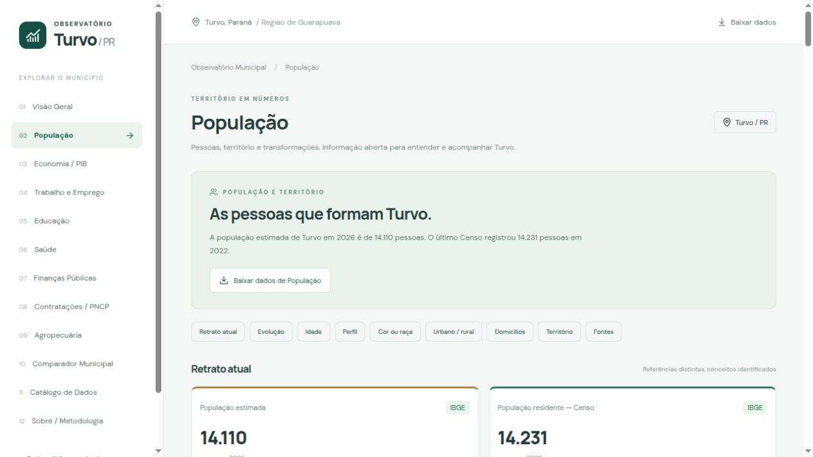

# Módulo População de Turvo / PR

## Escopo e atualização

Página `#population`, implementação em `src/modules/population/`. Mantém Vite/React/TypeScript e Recharts. Nenhuma fonte é consultada pelo navegador: ele lê somente `public/data/population.json`. Código IBGE 4127965. Snapshot exclusivamente oficial, sem mocks.

```sh
python3 scripts/etl.py --module population
python3 scripts/etl.py --module population --offline
npm test
npm run build
```

`--module population` não recolhe Economia nem outros módulos. O comando padrão inclui o ETL legado e depois População. O ETL atualiza apenas os objetos do módulo population no catálogo geral; os demais indicadores permanecem iguais. O comparador mantém os snapshots regionais já existentes, comparando apenas referências, unidades e métodos compatíveis. Estimativas nunca são comparadas com Censo.

## Fontes utilizadas

Todos os IDs, nomes, categorias, nível N6, períodos e unidades foram confirmados nos metadados oficiais antes da implementação. As consultas exatas, os metadados e suas respostas estão no snapshot e em `public/data/population/raw`.

| Conjunto | Tabela/API | Variáveis | Recorte e referência |
| --- | --- | --- | --- |
| Censo, densidade e área censitária | 4714 | 93, 614, 6318 | Município, 2022 |
| Estimativas anuais | 6579 | 9324 | Município, anos efetivamente publicados; última referência confirmada 2026 |
| História censitária | 202 | 93 | Sexo total (2=0), situação total (1=0); 1991, 2000, 2010 disponíveis para Turvo |
| Crescimento compatibilizado | 4709 | 93, 5936, 10605 | 2022; variação absoluta 2010–2022 e taxa geométrica oficiais |
| Sexo/idade | 9606 | 93 | Cor ou raça total (86=95251), sexo (2=6794,4,5), idade (287); 2022 |
| Cor ou raça | 9606 | 93 | Sexo total (2=6794), idade total (287=100362), cor ou raça (86); 2022 |
| Indicadores demográficos | 9756 | 9175, 10613, 8845 | Cor ou raça total (86=95251); 2010 e 2022 |
| Urbana/rural | 9923 | 93 | Situação (1=6795,1,2); 2022 |
| Domicílios | 9922 | 381, 382, 5930 | Situação total (1=6795); 2022 |
| Área anual | API Pesquisas, indicador 29167 | 29167 | Unidade km², multiplicador 1; última referência confirmada 2025 |
| Localidade e regiões | API Localidades | Município 4127965 | Cadastro consultado na coleta |
| Contorno municipal | API Malhas v3 | Município 4127965 | `periodo=2022`, `qualidade=intermediaria`, GeoJSON |

Tabela 202 é usada somente para história censitária; não para urbano/rural atual. Tabela 579 é substituída pela 9922 de 2022. Área anual não é extraída da antiga tabela 1301 nem da geometria simplificada: usa a API Pesquisas com nome/unidade verificados. Esta API responde com o código municipal de seis dígitos `412796`, sem dígito verificador; o adaptador valida essa correspondência explícita.

## Definições e decisões metodológicas

- **Censo e estimativa:** a população residente do Censo 2022 é uma contagem; estimativas anuais têm data de referência 1º de julho e metodologia própria. Gráficos e narrativas permanecem separados. Revisões e alterações territoriais podem mudar a série de estimativas; não a interpretamos como crescimento censitário.
- **Área e densidade:** área territorial 2025 é 936,038 km². Densidade oficial 2022 é 15,16 hab/km², usando a área censitária da sua própria edição. Não recalculamos densidade com a área mais recente.
- **Histórico censitário:** 1991, 2000, 2010 e 2022 são os períodos efetivamente disponíveis para Turvo nas tabelas escolhidas. 1970 e 1980 retornam `...`; preservamos as respostas brutas e omitimos estes pontos. Não interpolamos anos. Os segmentos do gráfico conectam somente observações publicadas; não representam estimativas dos anos intermediários.
- **Crescimento:** a tabela 4709 publica variação absoluta de 157 pessoas e taxa geométrica de 0,09% ao ano. Base 2010 compatibilizada é derivada como 14.231 − 157 = 14.074. Percentual é calculado como 157 / 14.074 × 100 (aproximadamente 1,12%). O Censo 2010 original da tabela 202 é 13.811, sob os limites daquela publicação. Não usamos 13.811 para a variação compatibilizada. A diferença é explicitada junto ao gráfico.
- **Idade:** usamos somente categorias disjuntas de nível 1 da tabela 9606, evitando dupla contagem das idades simples. Grupos 0–4, 5–9, 10–14 e 15–19 são originais; os demais somam grupos quinquenais em 20–29, 30–39, 40–49, 50–59, 60–69, 70–79 e 80+. Os IDs de todas as categorias somadas constam nos registros e no código. Não calculamos idade mediana a partir dos grupos: usamos o indicador oficial.
- **Índice de envelhecimento:** variável 9175, pessoas de 60 anos ou mais por 100 pessoas de 0 a 14 anos. Não confundir com índices que adotam 65 anos. **Razão de sexo:** variável 8845, homens por 100 mulheres. **Idade mediana:** variável 10613, idade que divide a população em duas metades. Fonte das definições: [publicação étnico-racial do IBGE](https://www.ibge.gov.br/biblioteca/visualizacao/periodicos/3105/cd_2022_etnico_racial.pdf).
- **Cor ou raça:** nomes oficiais Branca, Preta, Amarela, Parda e Indígena. A categoria de cor ou raça Indígena não equivale ao universo ampliado que inclui o quesito “se considera indígena”. Percentuais usam o total desta própria tabela.
- **Domicílios:** particulares permanentes ocupados. Há 14.225 moradores nesse universo, diferente das 14.231 pessoas da população residente. Não forçamos igualdade de universos distintos. Média de 2,84 moradores é o valor publicado pelo IBGE, arredondado.
- **Malha:** somente geometria de Turvo, cerca de 3,4 KB na resposta oficial. Mapa informativo de 2022, distinto da área 2025; não serve para medições cadastrais. A projeção local do desenho corrige longitude pela latitude média. Nenhum mapa externo é baixado.

## Símbolos SIDRA e validações

[Símbolos especiais do SIDRA](https://sidra.ibge.gov.br/tabela/7361): `-` é zero absoluto; `0` pode decorrer de arredondamento; `X` é valor inibido; `..` não aplicável; `...` indisponível. O adaptador IBGE opta explicitamente pelo zero absoluto para `-`, guarda `rawSymbol` no parsing e preserva a resposta bruta. Os demais símbolos não viram zero. Exemplo observado: homens com 100 anos ou mais em 2022 retornam `-`.

Todas as células solicitadas devem estar presentes uma única vez, com município N6, variável, período, categoria e unidade corretos. Contagens precisam ser inteiras e finitas. O total deve ser positivo. As faixas de idade não podem se sobrepor; sexo e idade devem somar os totais do mesmo universo. Percentuais são calculados sem arredondamento no JSON e exibidos com até duas casas; validação aceita erro flutuante de até `1e-8`, sem tolerância para diferenças de contagens inteiras. Não força igualdade entre domicílios e população residente ou entre a história original e a base compatibilizada.

## Schema e auditoria

`schemaVersion: 1`. Contrato TypeScript em `types.ts` e validador Python em `population.py`.

- `summary`: quatro indicadores com conceito, método, unidade, referência, coleta, órgão, URL e município.
- `populationHistory` e `estimateHistory`: observações separadas com período, método e `sourceId`.
- `growth`: base compatibilizada, variação absoluta oficial, percentual calculado e taxa oficial.
- `ageSex`: categorias de origem, grupos agregados, Homens/Mulheres, total e percentual.
- `sex`, `race`, `urbanRural`: total próprio e categorias com quantidade/percentual.
- `demographicIndicators` e `households`: indicadores com metadados completos e séries/recortes próprios.
- `territory`: geometria municipal e regiões oficiais.
- `sources`: pesquisa, tabela/indicador, variáveis, unidades, classificações/categorias, períodos, URLs de consulta e metadados, coleta, transformações e caminho para a resposta bruta.
- `collection`: tentativa, último sucesso, falhas e política de preservação.

Arquivos brutos têm nomes com hash do conteúdo, permitindo referenciar exatamente a resposta usada. Todos os dados atuais são pequenos agregados municipais. Não há microdados pessoais.

## Falhas, periodicidade e downloads

Qualquer falha de fonte ou validação requerida preserva integralmente o snapshot anterior. Na primeira coleta, uma falha não publica números fictícios. A tentativa e a falha ficam registradas; o processo retorna código de erro para sinalizar a automação. Datas de coleta dos valores preservados não são alteradas. A gravação JSON é atômica; arquivos derivados podem ser reconstruídos do snapshot. O ETL não substitui valores oficiais por uma resposta incompleta.

A automação semanal está pronta, mas depende da ativação dos workflows no repositório. Censo tem periodicidade censitária; estimativas e área são anuais; malha e cadastro dependem de publicação pelo órgão. Verificar semanalmente não cria referências semanais.

Downloads: JSON completo, CSVs de Censo, estimativas, idade/sexo e cor/raça; GeoJSON municipal. CSVs trazem referência e URL oficial da fonte. JSON e respostas brutas mantêm detalhes de classificações e transformações.

## MCP Brasil e próximos passos

Analisada a feature IBGE do [MCP Brasil](https://github.com/Mcp-Brasil/mcp-brasil/tree/2efb258370b125bbf190884283ae10f209b9d335/src/mcp_brasil/data/ibge), revisão `2efb258370b125bbf190884283ae10f209b9d335`, licença MIT. Seus clientes de agregados, localidades, listagem de pesquisas e malhas servem como referência de descoberta. Não copiamos código nem adicionamos dependência MCP. Diferentemente de uma resposta formatada para IA, o ETL mantém períodos, unidades e classificações para auditoria. Fonte autoritativa de todos os valores publicados: IBGE.

Próximos passos: ampliar o comparador regional com snapshots do novo schema; incorporar futuras edições oficiais da malha e Censo; avaliar história em geografia compatível além de 2010. Não há dado pendente nos recortes atuais solicitados que foram confirmados. Períodos anteriores a 1991 e a compatibilização dos Censos antigos permanecem sem publicação neste módulo.

Para adicionar um indicador: descobrir a tabela e seus metadados, confirmar N6, período e unidades, declarar IDs e nomes em `collect`, registrar fonte/conceito, adicionar validação e fixture oficial pequena, gerar snapshot, testar e revisar a tabela metodológica. Não editar manualmente os números do JSON.

## Validação desta entrega

44 testes offline (36 Python + 8 JavaScript) aprovados, incluindo parsing, metadados, idade, percentuais, preservação integral, CSVs, narrativas determinísticas e carregamento/erro do snapshot. Build TypeScript/Vite aprovado. Revisão em navegador para desktop e viewport 390×844: cards, pirâmide, tooltip, tabela acessível e território. Todos os downloads responderam HTTP 200. Conferência contra `origin/main` confirmou que os dados dos demais módulos e `comparison.json` permaneceram iguais.


