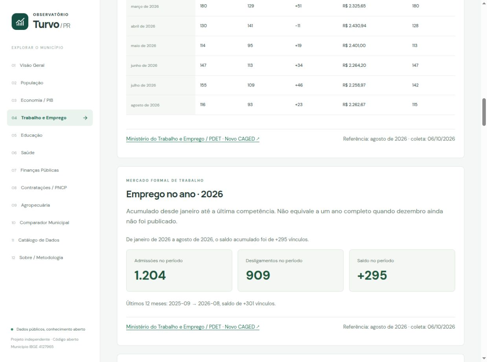

# Trabalho e Emprego · Turvo/PR

Módulo estático e independente da Prefeitura. Fonte autoritativa: Ministério do Trabalho e Emprego / PDET. Município padrão IBGE **4127965**, código MTE **412796**, **UF 41 / PR**. O mapeamento explícito também cobre Guarapuava 4109401→410940, Pitanga 4119608→411960 e Laranjal 4113254→411325. O homônimo Turvo/SC 421880 é excluído; nunca filtramos por nome.

## Publicação encontrada em 06/10/2026

| Base / indicador | Referência de Turvo | Resultado |
|---|---|---:|
| RAIS · vínculos formais ativos em 31/12, excluídos abandonados | 2025 | 2.763 |
| RAIS · estoque histórico da edição 2025 | 2023 / 2024 / 2025 | 2.466 / 2.513 / 2.763 |
| RAIS · remuneração nominal média de dezembro dos vínculos com valor positivo | 2025 | R$ 3.322,65 |
| RAIS · amostra salarial / ausentes ou zero | dezembro/2025 | 2.610 / 153 vínculos |
| Novo CAGED · admissões / desligamentos / saldo | agosto/2026 | 116 / 93 / +23 |
| Novo CAGED · acumulado de admissões / desligamentos / saldo | janeiro–agosto/2026 | 1.204 / 909 / +295 |
| Novo CAGED · janela móvel de admissões / desligamentos / saldo | setembro/2025–agosto/2026 | 1.554 / 1.253 / +301 |
| Novo CAGED · salário nominal médio das admissões válidas | agosto/2026 | R$ 2.262,67 · amostra 115 |

A série mensal publicada compreende **setembro/2024 a agosto/2026**, ajustada até a divulgação de agosto/2026. Esses períodos descrevem esta primeira coleta; o coletor descobre os próximos períodos no MTE e não considera agosto/2026 ou RAIS 2025 eternamente atuais.

## Fontes e arquivos de origem

- [Portal MTE/PDET](https://www.gov.br/trabalho-e-emprego/pt-br/acesso-a-informacao/acoes-e-programas/programas-projetos-acoes-obras-e-atividades/estatisticas-trabalho).
- [Microdados RAIS e CAGED](https://www.gov.br/trabalho-e-emprego/pt-br/acesso-a-informacao/acoes-e-programas/programas-projetos-acoes-obras-e-atividades/estatisticas-trabalho/microdados-rais-e-caged).
- [Divulgação RAIS 2025, tabelas e nota técnica](https://www.gov.br/trabalho-e-emprego/pt-br/acesso-a-informacao/acoes-e-programas/programas-projetos-acoes-obras-e-atividades/estatisticas-trabalho/rais/rais-2025/rais-2025).
- [XLSX RAIS 2025](https://www.gov.br/trabalho-e-emprego/pt-br/acesso-a-informacao/acoes-e-programas/programas-projetos-acoes-obras-e-atividades/estatisticas-trabalho/rais/rais-2025/rais-2025/rais-2025-tabelas.xlsx), **Tabela 4**: municípios, UF, cinco grandes grupos, estoque e anos 2023–2025.
- RAIS microdados: `ftp://ftp.mtps.gov.br/pdet/microdados/RAIS/2025/RAIS_VINC_PUB_SUL.7z` (704.888.712 bytes; membro `RAIS_VINC_PUB_SUL.COMT`, cerca de 4,34 GB descompactados). Não é extraído inteiro: lemos o fluxo de saída do 7-Zip.
- [Novo CAGED agosto/2026](https://www.gov.br/trabalho-e-emprego/pt-br/acesso-a-informacao/acoes-e-programas/programas-projetos-acoes-obras-e-atividades/estatisticas-trabalho/novo-caged/2026/agosto/pagina-inicial).
- [Sumário executivo agosto/2026](https://www.gov.br/trabalho-e-emprego/pt-br/acesso-a-informacao/acoes-e-programas/programas-projetos-acoes-obras-e-atividades/estatisticas-trabalho/novo-caged/2026/agosto/sumario-executivo_agosto-de-2026.pdf): total nacional de conferência e filtros salariais.
- Microdados mensais: `ftp://ftp.mtps.gov.br/pdet/microdados/NOVO%20CAGED/AAAA/AAAAMM/CAGED{MOV,FOR,EXC}AAAAMM.7z`.
- Layout e descrições CNAE/territórios: `ftp://ftp.mtps.gov.br/pdet/microdados/NOVO%20CAGED/Layout%20N%C3%A3o-identificado%20Novo%20Caged%20Movimenta%C3%A7%C3%A3o.xlsx`, modificado em 31/08/2022.
- [Downloads oficiais CBO](https://www.gov.br/trabalho-e-emprego/pt-br/assuntos/cbo/servicos/downloads/downloads) e [CSV de ocupações](https://www.gov.br/trabalho-e-emprego/pt-br/assuntos/cbo/servicos/downloads/cbo2002-ocupacao.csv), cp1252. O dicionário é a união de títulos oficiais dessa lista e do layout PDET, com proveniência e hash registrados.
- [ISPER — Dados por Município](https://www.gov.br/trabalho-e-emprego/pt-br/assuntos/estatisticas-trabalho/isper-dados-por-municipio) e [Perfil do Município](https://bi.trabalho.gov.br/bgcaged/caged_perfil_municipio/index.php): referências para conferência humana, sem scraping automatizado frágil.
- Salário mínimo: [Decreto 12.797/2025 (2026)](https://www.planalto.gov.br/ccivil_03/_ato2023-2026/2025/decreto/d12797.htm), [histórico oficial TRT-MG](https://portal.trt3.jus.br/internet/servicos/valores/salario-minimo): 2024 R$ 1.412; 2025 R$ 1.518; 2026 R$ 1.621.

O portal ainda aponta o FTP oficial, que respondeu à coleta. HTTPS no mesmo host não respondeu à verificação inicial. O transporte é configurável; não presumimos estabilidade eterna do FTP. Não publicamos arquivos nacionais nem identificadores pessoais.

## RAIS e Novo CAGED: conceitos distintos

**RAIS** é o retrato anual dos vínculos formais ativos em 31 de dezembro, incluindo celetistas e estatutários segundo sua cobertura administrativa. Uma pessoa pode possuir mais de um vínculo. A tabela 4 da edição 2025 permite uma série recente na mesma edição/revisão, começando em 2023. A captação integral eSocial desde 2023 exige cautela, principalmente no setor público; não atribuímos automaticamente diferenças à conjuntura econômica.

A nota técnica RAIS 2025, seção 16, determina a segregação dos vínculos abandonados do estoque principal. O parser de microdados aplica `Ind Vínculo Ativo 31/12 - Código = 1` e `Ind Vínculo Abandonado - Código = 0`. Ignorar esse segundo campo daria 2.771 vínculos para Turvo, em desacordo com os 2.763 publicados; esse cenário é rejeitado.

**Novo CAGED** mede eventos de admissão e desligamento de vínculos celetistas por competência. **Saldo = admissões − desligamentos**. Admissões, saldo e estoque são conceitos distintos; eventos não são pessoas únicas. Não reconstruímos estoque como RAIS anterior + saldos, não criamos taxas de emprego/desemprego municipais e não dividimos saldo pela população. Sem estoque oficial mensal compatível, a comparação usa absolutos e explica o efeito do tamanho municipal.

CAGED anterior a 2020 não é concatenado automaticamente ao Novo CAGED. A série desta implementação fica dentro da metodologia de consolidação publicada a partir de outubro/2021.

## Layouts e leitura segura

O conector `scripts/sources/mte.py` normaliza nomes de coluna (acentos, espaços e pontuação), valida o conjunto completo de campos e resolve posições pelos nomes. Ordem diferente de colunas é aceita; campo novo, ausente ou duplicado causa falha segura. Não usa índices presumidos.

| Fonte | Formato verificado | Contrato |
|---|---|---|
| Novo CAGED MOV/FOR | TXT, UTF-8, `;` | 28 campos; competência de movimentação e declaração, UF, município, CNAE, CBO, sinal, salário e flags |
| Novo CAGED EXC | TXT, UTF-8, `;` | 30 campos, incluindo competência de exclusão e indicador de exclusão |
| RAIS tabela 4 | XLSX, XML lido pela biblioteca padrão | UF, Código, cabeçalhos dos grupos e anos; somas setoriais exatas |
| RAIS microdados 2025 | `.COMT`, texto CSV com vírgula, cp1252 | **62 campos**, inclusive ativo, abandonado e remuneração nominal; cadastrado em `mte-layouts.json` |

Os layouts legados RAIS em XLS disponíveis no FTP foram consultados para os conceitos das variáveis; **não impomos o formato legado de TXT com ponto e vírgula à RAIS 2025**. O contrato atual vem do cabeçalho do arquivo público 2025 e da nota técnica da edição. Remuneração de um novo ano requer revisão do layout antes de cadastrá-lo; a coleta de estoque por tabela funciona independentemente.

## Ajustes, revisões e janelas

Para cada divulgação mensal processamos:

1. `MOV`: declarações dentro do prazo;
2. `FOR`: declarações fora do prazo, adicionadas à **competência original da movimentação**;
3. `EXC`: exclusões, subtraídas da contagem correspondente na competência original (cancelar admissão reduz admissões; cancelar desligamento reduz desligamentos).

O `Leia-me.txt` oficial documenta esse mecanismo. Nunca interpretamos exclusão de desligamento como nova admissão. Os arquivos de todos os meses de declaração dentro da janela são processados até a divulgação final. Movimentações anteriores ao início da janela são ignoradas.

A janela padrão tem **24 competências**, incluindo a mais recente. Assim ficam completos o acumulado de janeiro à última competência e os últimos 12 meses. A opção `--window 12` pode produzir um acumulado indisponível quando janeiro fica fora da janela: o programa não apresenta uma soma parcial como acumulado anual.

Cada competência está representada quando os três arquivos oficiais foram lidos integralmente. Ausência de eventos em um município após essa leitura significa zero; arquivo ausente não significa zero. Download/parser incompleto preserva o dataset anterior.

Comparações de snapshots registram `revisionDetectedAt`, município, mês, contagens/salário anteriores e novos. O Git dá rastreabilidade adicional. O fluxo normal não baixa a mesma divulgação novamente; `--force` permite revisão na mesma competência. Cache FTP verifica `SIZE`, `MDTM` e hash local antes do reaproveitamento. Para origem HTTPS, a rotina confere tamanho, Last-Modified e ETag por HEAD antes do reaproveitamento; sem confirmação de validade, baixa novamente. O manifesto de descoberta precisa ser mantido pelo responsável pela origem.

## Setores, atividades, ocupações e privacidade

Os cinco grupos oficiais são Agropecuária (CNAE A), Indústria (B–E), Construção (F), Comércio (G) e Serviços (H–U). A RAIS usa as divisões equivalentes a partir da classe CNAE 2.0. Estoque/setor RAIS e fluxo/setor CAGED aparecem em seções distintas.

CNAE e CBO são dimensões separadas. Não há cruzamentos por idade, sexo, raça ou estabelecimento. Não publicamos CPF/CNPJ. Nos detalhamentos de CNAE e CBO, qualquer contagem **positiva de 1 a 4** de admissões ou desligamentos é agregada em “Outras categorias”. Caso o grupo agregado ainda seja pequeno, agrupamos também a menor categoria visível; se nem assim a dimensão alcançar o limite, suprimimos o detalhamento completo. O total da dimensão publicável é conservado. Os totais municipais e cinco grandes grupos, sem características pessoais, continuam disponíveis.

A interface mostra até 10 categorias detalhadas por admissões, com grupos agregados ao final. O JSON/CSV contém todas as categorias publicáveis de cada competência, sem dados individuais. Alguns códigos dos microdados não constam dos dicionários oficiais consultados: ficam em “sem descrição validada (agregadas)”, sem título inventado. Flags de completude do dicionário estão no snapshot.

## Remuneração e salário das admissões

**Novo CAGED:** média aritmética do campo **`salário`**, documentado como salário mensal declarado; não usamos `valorsaláriofixo` como se fosse sempre mensal. Aplicamos os filtros do sumário MTE: excluir intermitentes, ausências e valores inferiores a 0,3 ou superiores a 150 salários mínimos da competência. Ajustes FOR/EXC afetam também soma e amostra. Publicação somente com amostra ≥5. Os mínimos estão explicitamente configurados em `SM`; um ano ainda não configurado deixa o salário indisponível sem impedir os fluxos.

**RAIS:** média aritmética do campo **`Vl Rem Dezembro Nom`**, somente dos vínculos ativos, não abandonados e com valor nominal positivo de dezembro. Valores ausentes/zero não são imputados; amostra e faltantes são informados. Médias setoriais exigem amostra ≥5. É um indicador calculado pelo observatório a partir do campo oficial, **não a média anual, não renda da população, não salário mínimo, não remuneração real**. Não reproduzimos automaticamente as médias nacionais deflacionadas por INPC divulgadas pelo MTE.

A nota RAIS 2025, seção 18, registra omissões declaratórias de remuneração em entes públicos; por isso a cobertura salarial é indispensável e a média pode não representar todos os vínculos. Evolução salarial RAIS está pendente: apenas 2025 possui microdados processados nesta entrega.

## Validações executadas

- Identidade territorial explícita, homônimo excluído e mesmos códigos nos quatro comparadores.
- Soma de cinco setores = estoque oficial da tabela 4 para cada município e ano 2023–2025: **tolerância zero**.
- RAIS 2025 microdados = tabela 4 no estoque total e em cada um dos cinco setores, nos quatro municípios: **tolerância zero**, após exclusão de vínculos abandonados.
- Cada mês: saldo = admissões − desligamentos; classificações reconciliadas com o total antes da proteção; janelas contínuas e acumulados conferidos.
- Novo CAGED nacional agosto/2026: **2.294.563 admissões − 2.128.736 desligamentos = 165.827**; coincidência exata com o sumário executivo. Controle em `scripts/config/employment-validation.json`, com URL/página/período. Novas competências sem total de controle cadastrado ficam com `validation.status=pending`, nunca “matched”. TODO: automatizar a obtenção dos controles oficiais por divulgação.
- **Conferência independente municipal CAGED no ISPER/Perfil: pendente.** A pasta de tabelas ligada à divulgação não forneceu um arquivo municipal na pesquisa inicial; não declaramos uma validação que não ocorreu. Remuneração municipal também não foi comparada a um segundo total publicado.
- Python: fixtures reais projetadas, códigos/UF, contagens, sinais, atrasos/exclusões, janelas, salários, formatos, revisão, proteção de pequenas células, downloads incompletos e preservação do snapshot.
- JavaScript: narrativas, sinais, moeda, carregamento local/erro, comparações incompatíveis e período.
- TypeScript/build e inspeção visual em desktop/mobile, gráficos e alternativas tabulares. **135 testes passaram (103 Python + 32 JavaScript)**; build aprovado. A atualização forçada completa dos 72 arquivos CAGED também reproduziu os mesmos valores, sem revisões detectadas.



`public/data/metadata/employment/rais-table4.json` guarda o recorte oficial de tabela usado. `rais-microdata-validation.json` guarda os controles por município. O snapshot inclui órgão, URL, referências, coleta, versão/layout, códigos, conceito, filtros, transformações, tamanhos, SHA256 e revisões. SHA256 é calculado na coleta, não é uma assinatura publicada pelo MTE.

## Operação e custo

```sh
# Base completa: descobrir publicação e atualizar só quando houver período novo.
python3 scripts/etl.py --module employment

# CAGED: mensal, 24 competências. Dados antigos são preservados em caso de erro.
python3 scripts/etl.py --module employment --source caged

# Revisões na mesma divulgação. Cache fora de public/data, ignorado pelo Git.
python3 scripts/etl.py --module employment --source caged --force --cache .mte-cache

# RAIS: tabela municipal pequena, HTTPS. Remuneração opcional baixa arquivo regional grande.
python3 scripts/etl.py --module employment --source rais
python3 scripts/etl.py --module employment --source rais --rais-remuneration --cache .mte-cache

# Períodos explicitamente configurados, sem descoberta; úteis para reprodução:
python3 scripts/etl.py --module employment --source caged --latest 202608 --rais-year 2025 --force

# Validação sem rede e build estático:
python3 scripts/etl.py --module employment --offline
npm test
npm run build
```

Requisitos: Python padrão 3.10+, Node/npm existentes e **7-Zip** (Ubuntu: pacote `7zip`; também reconhece `7zz`, `7z` ou `MTE_7ZIP=/caminho/do/binario`). A biblioteca Python não descompacta 7z; esse único executável adicional evita carregar arquivos nacionais inteiros na memória. Não há pacote Python externo. O 7-Zip verifica integridade/CRC ao terminar o fluxo.

`MTE_BASE_URL` desacopla a origem dos arquivos. O padrão é FTP oficial; para uma origem HTTPS autorizada/configurada, fornecer `MTE_MANIFEST_URL` apontando um JSON com `caged` (AAAAMM), `rais` (ano) e opcionalmente `availableMonths`, ou informar os dois períodos pela CLI. `MTE_RAIS_TABLE_URL` permite uma nova localização explícita da tabela oficial. Não usamos espelhos privados como fonte principal.

O download tem timeout, retry exponencial, assinatura 7z, tamanho remoto quando disponível, arquivo `.part`, hash SHA256, escrita por substituição e validação do dataset antes de publicação. Sem `--cache`, os arquivos comprimidos são descartados depois de cada competência e ao finalizar. Com cache, ficam apenas no diretório não público escolhido. Processamento linha a linha filtra município/UF antes de criar estruturas; nenhum CSV nacional descompactado é gravado.

O ETL semanal `all` **não executa** as bases nacionais de Trabalho. O workflow independente em `docs/github-actions/employment.yml` verifica CAGED no dia 3 de cada mês, e permite RAIS manual, reprocessamento e remuneração opcional. Compartilha a fila de atualização de dados, valida antes de commitar e só faz commit quando há diferença. Tempo limite do job pesado: 180 minutos. O modelo de deploy existente é mantido; sem secrets, nenhum serviço pago é provisionado.

Os workflows continuam como templates em `docs/github-actions`: a credencial GitHub desta sessão não possui escopo `workflow`, conforme limitação já registrada no README. Para ativá-los, conceder esse escopo e copiar para `.github/workflows`. Até lá não existe atualização agendada ativa no remoto.

O frontend lê apenas `public/data/employment.json` (aproximadamente 1,4 MB de JSON formatado, muito menor comprimido), gráficos com Recharts já instalado. CSVs em `public/data/exports`: `caged-monthly`, `caged-sectors`, `caged-occupations`, `caged-activities`, `rais-stock`, `rais-sectors`. Todos incluem município, base e coleta; salários RAIS só têm valores no ano efetivamente processado. Cloudflare Pages serve o build sem Worker, banco, VPS ou credencial exposta.

## MCP Brasil e próximos passos

Inspecionado [Mcp-Brasil/mcp-brasil, commit 2efb258370b125bbf190884283ae10f209b9d335](https://github.com/Mcp-Brasil/mcp-brasil/tree/2efb258370b125bbf190884283ae10f209b9d335), versão atual na consulta de 06/10/2026. Não há feature municipal MTE/RAIS/Novo CAGED. O [catálogo BACEN](https://github.com/Mcp-Brasil/mcp-brasil/blob/2efb258370b125bbf190884283ae10f209b9d335/src/mcp_brasil/data/bacen/catalog.py#L151) oferece indicadores macro, incluindo SGS 28561 (saldo CAGED), PNAD e rendimento. Essas séries nacionais **não representam Turvo** e não foram inseridas no módulo.

Oportunidade upstream, sem implementar servidor MCP aqui: feature `mte_trabalho` com ferramentas conceituais `mte_caged_municipio`, `mte_caged_setores`, `mte_caged_ocupacoes`, `mte_rais_municipio`, `mte_rais_setores`, usando agregados versionados e a mesma validação territorial/metodológica.

TODOs prioritários: conferir CAGED municipal no ISPER/Perfil com mesma data de revisão; automatizar controles das divulgações; RAIS Estabelecimento com vínculos (não empresas juridicamente ativas); história salarial comparável; atualização das descrições oficiais ausentes; testes de revisões da fonte em execução periódica. Perfil por sexo/idade/escolaridade e cor/raça não foi implementado: exige justificativa e proteção adicional, sem cruzamentos individuais.
